## **📘 Repo Sweeping Process — Explained**

### **What is Repo Sweeping?**

Repo sweeping is the **centralized mechanism** by which all bond long/short positions across RMB’s trading desks are transferred (“swept”) to the **Repo Desk**, which acts as the single point of contact with the external repo market.

This ensures:

- **Collateral optimisation** – the bank sees all eligible securities in one place.
- **Liquidity efficiency** – one central desk negotiates repo rates.
- **Risk control** – traders don’t face external repo counterparties directly.
- **Transparency** – funding costs recorded via FTP and internal mirror trades.

---

### **🔹 Long Position Example (Trader Buys a Bond)**

1. Bond Desk agrees to buy **R100m SA Government Bond** (T+2 settlement).
2. On settlement day, Repo Desk simultaneously:
    - Receives the bond into its custody account.
    - Repos it out to a market counterparty, receiving cash.
    - Uses that cash to pay the seller.
3. Internally:
    - Repo Desk allocates the bond to the Bond Desk (mirror entry).
    - Bond Desk shows: _Bond asset + Repo loan liability_.
    - Repo Desk shows: _Internal loan asset + External repo liability_.

**Custody flow (DvP at CSD):**

- Seller → Repo Desk custody → Repo Counterparty (pledge).
    
- Cash: Repo Counterparty → Repo Desk → Seller.
    
    ```mermaid
    sequenceDiagram
        autonumber
        title LONG: Buy R100m bond & fund via repo (T+0 → T+2)
    
        participant TD as Trading Desk (internal)
        participant RD as Repo Desk (internal)
        participant SELL as Market Seller (external)
        participant RC as Repo Counterparty (external)
        participant CSD as CSD/Settlement System
    
        Note over TD: T+0: TD agrees to BUY R100m bond (settles T+2).<br/>Funding need on T+2.
        TD->>RD: Notify funding need for T+2
        RD->>RC: Pre-arrange REPO OUT for T+2 (cash in, bond pledged)
    
        Note over CSD: T+2 settlement (DvP):<br/>cash and securities synchronised
        RC-->>RD: Cash (value T+2)
        RD-->>SELL: Cash to pay seller
        SELL-->>RD: Bond delivered to RD custody
        RD-->>RC: Bond pledged as repo collateral
    
        Note over TD,RD: Internal mirror booking
        RD-->>TD: Allocate bond position internally
        TD-->>RD: Internal loan liability @ FTP rate
    ```
    

---

### **🔹 Short Position Example (Trader Sells a Bond)**

1. Bond Desk agrees to sell **R50m bond** it doesn’t own.
2. Repo Desk arranges a **reverse repo** with the market:
    - Repo Desk lends cash externally.
    - Market counterparty delivers the bond into Repo Desk custody.
3. Internally:
    - Repo Desk lends the borrowed bond to the Bond Desk (mirror).
    - Bond Desk delivers the bond to the client and receives sale cash.

**Custody flow (DvP at CSD):**

- Repo Counterparty → Repo Desk custody → Client.
- Cash: Client → Trading Desk.

```mermaid
sequenceDiagram
    autonumber
    title SHORT: Sell R50m bond & borrow via reverse repo (T+0 → T+2)

    participant TD as Trading Desk (internal)
    participant RD as Repo Desk (internal)
    participant LEND as Repo Lender (external)
    participant CLIENT as Client Buyer (external)
    participant CSD as CSD/Settlement System

    Note over TD: T+0: TD agrees to SELL R50m bond.<br/>Desk does not own bond.

    TD->>RD: Request bond borrow for settlement
    RD->>LEND: Pre-arrange REVERSE REPO (cash out, receive bond)

    Note over CSD: T+2 settlement (DvP): reverse repo + client sale
    RD-->>LEND: Cash (value T+2)
    LEND-->>RD: Bond delivered to RD custody

    Note over TD,RD: Internal allocation
    RD-->>TD: Lend bond internally for delivery

    TD-->>CLIENT: Deliver bond to client
    CLIENT-->>TD: Cash proceeds from sale

    Note over TD: End state:<br/>TD has sale cash & owes bond back to RD.<br/>RD owes bond back to lender at repo maturity.
```



---

### **🔹 Why Use a Central Repo Desk?**

- **Market access:** Concentrates borrowing/lending activity → better pricing.
- **Collateral management:** Avoids desks competing for the same bonds.
- **Operational simplicity:** Only one external settlement point (Repo Desk custody account).
- **FTP consistency:** Funding costs (repo rate + liquidity spread) embedded via mirror trades.

---

### **🔹 Relation to FTP**

- Repo funding trades are internalised via **mirror deals** between Repo Desk and Trading Desk.
- Repo Desk’s external trades are booked against GTSY portfolios.
- This allows Treasury to allocate true FTP cost of repo funding back to desks.

---

### **🔹 Controls and Custody**

- Repo Desk custody accounts sit at the **CSD / settlement agent** (e.g., Strate, Euroclear, Clearstream).
- Trading desks never instruct CSD directly — they only see internal mirror positions.
- Daily sweeps reconcile all long/short positions into Repo Desk accounts, ensuring:
    - **Zero unrecognised cash balances**.
    - **Central visibility of collateral**.
    - **Flat trading desks (no external exposures)**.

---

✅ **Summary**:

Repo sweeping makes the **Repo Desk a central “collateral warehouse”**. Trading desks hold market risk, but the Repo Desk holds custody and funding responsibility. All desks are “funded” internally at FTP repo rates, while Repo Desk optimises externally.