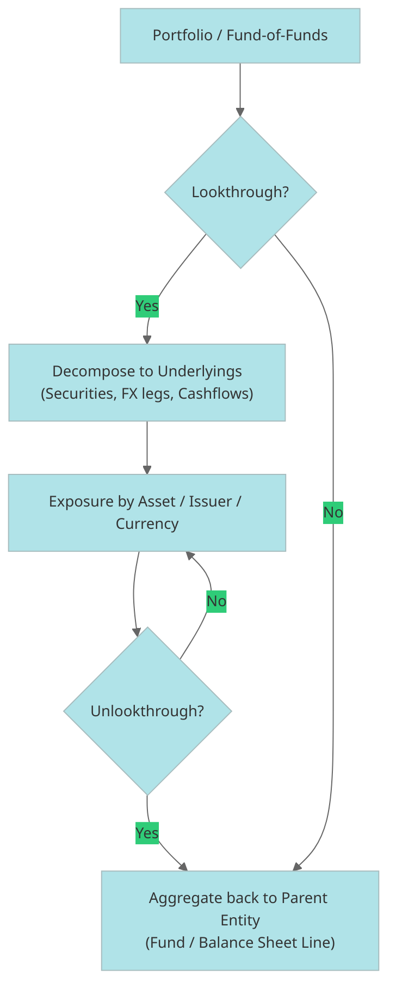
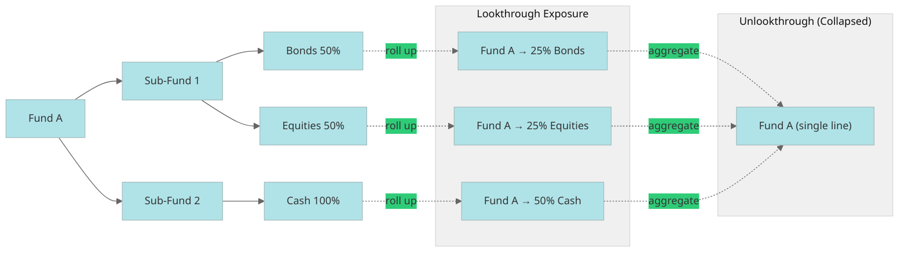
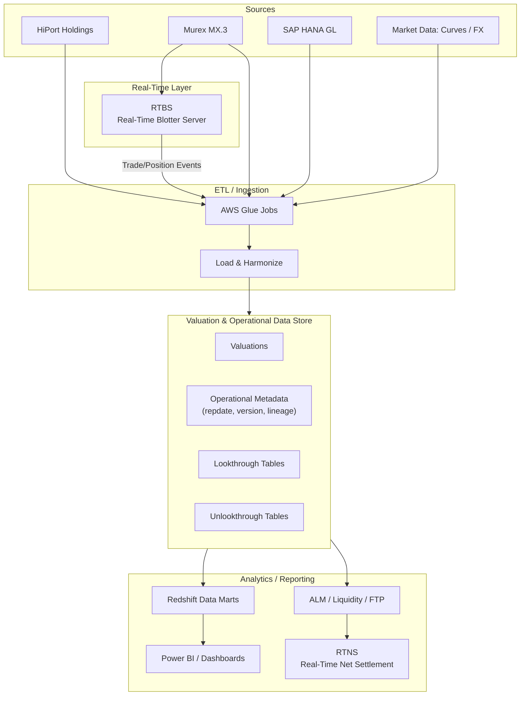
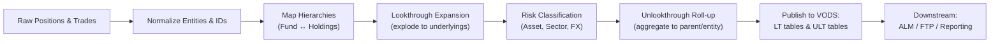
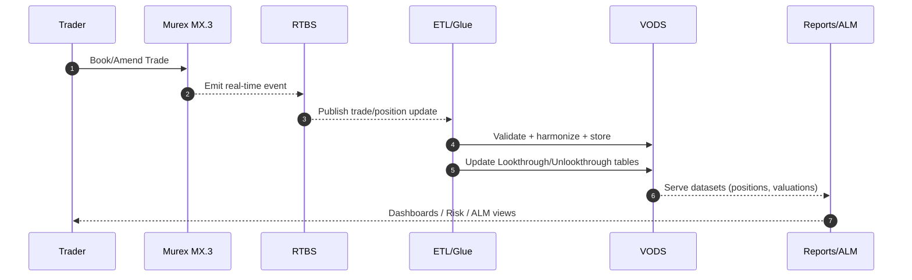
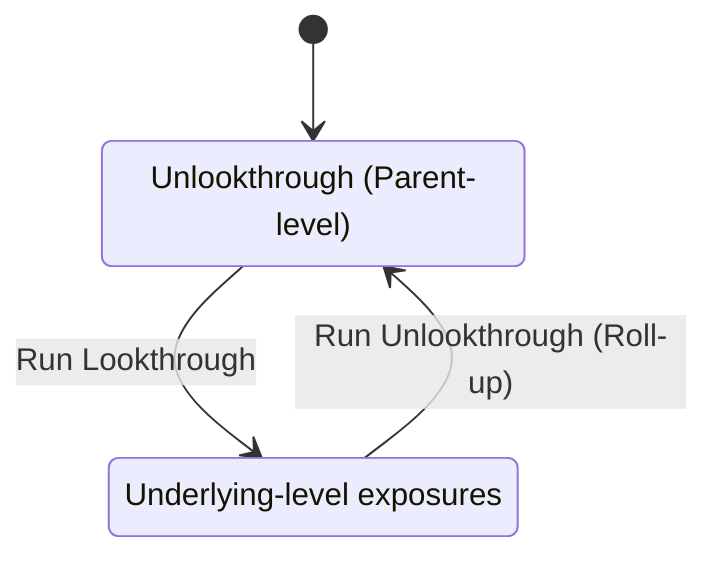

---
related:
  - "[[Finance]]"
type: "[[Notes]]"
---

> [!source] ChatGPT


> [!summary] Summary
> - Unlookthrough → Collapse (e.g. Aggregate to position)
> - Lookthrough → Expand (e.g. Drill-down to trade)

This sits right at the intersection of **treasury**, **risk**, and **data lineage / consolidation** concepts.  
The term **“unlookthrough”** (sometimes “un-look-through”) appears in contexts like **fund-of-funds**, **balance sheet aggregation**, **regulatory reporting**, and **Fintigrate / ALM data ingestion** pipelines.

Let’s break it down properly 👇

---

## 💡 **Definition**

An **“unlookthrough process”** refers to a **data or aggregation step where the system _stops looking through_ the underlying components or exposures of an instrument or entity**, and instead **treats it as a single aggregated position**.

> 🧩 In simple terms:  
> A _“lookthrough”_ process expands an instrument to reveal its underlying holdings.  
> An _“unlookthrough”_ process collapses it back to the parent level.

---

## 🧭 **Conceptual Example**

Imagine you have a **fund-of-funds** structure:

### 1) Lookthrough → Unlookthrough (conceptual flow)

```mermaid

flowchart TD
	A[Portfolio / Fund-of-Funds] --> B{Lookthrough?}
	B -- Yes --> C[Decompose to Underlyings<br/>(Securities, FX legs, Cashflows)]
	C --> D[Exposure by Asset/Issuer/Currency]
	D --> E{Unlookthrough?}
	E -- Yes --> F[Aggregate back to Parent Entity<br/>(Fund / Balance Sheet Line)]
	E -- No --> D
	B -- No --> F
	
```

```vbnet
Parent Fund (Fund A)  ├── Sub-Fund 1 → holds 50% Bonds, 50% Equities  ├── Sub-Fund 2 → holds 100% Cash
```


```mermaid
flowchart LR
  A[Fund A] --> B[Sub-Fund 1]
  A --> C[Sub-Fund 2]
  B --> B1[Bonds 50%]
  B --> B2[Equities 50%]
  C --> C1[Cash 100%]

  %% Lookthrough view
  subgraph LT[Lookthrough Exposure]
    L1[Fund A → 25% Bonds]
    L2[Fund A → 25% Equities]
    L3[Fund A → 50% Cash]
  end

  %% Unlookthrough view
  subgraph ULT[Unlookthrough (Collapsed)]
    U1[Fund A (single line)]
  end

  B1 -.roll up.-> L1
  B2 -.roll up.-> L2
  C1 -.roll up.-> L3
  L1 ==> U1
  L2 ==> U1
  L3 ==> U1

```


- **Lookthrough:**  
    You “look through” Fund A to see its ultimate exposure: 25% bonds, 25% equities, 50% cash.
    
- **Unlookthrough:**  
    You _collapse_ everything back to **Fund A as a single line item** (without tracing to sub-holdings).
    

---

## ⚙️ **In Treasury / Fintigrate / ALM Context**

In the **Fintigrate** or **Treasury data consolidation** context, the **unlookthrough process** typically refers to:

|**Process Stage**|**Description**|
|---|---|
|**Lookthrough**|The ETL expands nested fund, portfolio, or derivative positions to their **underlying securities or cashflows**, using _holding hierarchies_ or _reference mappings_.|
|**Unlookthrough**|The process where these detailed exposures are **rolled back up** to the parent fund, entity, or accounting line — often to match the **reporting entity’s balance sheet view**.|

---

### 🧩 Example in Practice (Sanlam / Fintigrate Type Setup)

|**Step**|**Process**|**Result**|
|---|---|---|
|**1. HiPort / Murex data load**|Load detailed portfolio holdings and derivatives.|Each fund or portfolio has detailed security-level exposures.|
|**2. Lookthrough process**|Decompose multi-layer funds into their underlying securities and FX exposures.|Now each asset class is fully transparent.|
|**3. Unlookthrough process**|Roll up those detailed lookthrough positions to the **ultimate holding entity** (e.g. a life fund, balance sheet, or legal entity).|Provides entity-level totals for ALM, liquidity, FTP, or IFRS reporting.|

---

## 🧮 **Why It Matters**

|**Area**|**Why You Need Unlookthrough**|
|---|---|
|**Regulatory Reporting (Solvency II, Basel III)**|Some reports require both lookthrough (to see risk exposure) _and_ unlookthrough (for balance sheet consistency).|
|**ALM & FTP**|Treasury needs entity-level totals, not exploded fund holdings.|
|**Data Lineage / VODS Layer**|Keeps two perspectives: _lookthrough data_ (risk transparency) and _unlookthrough data_ (reporting alignment).|
|**Performance & Storage**|Collapsing detailed exposures reduces data volume for downstream reporting.|

---

## 📊 **Visual Summary**

         `+----------------+          |  Lookthrough   |          |  (Expand Data) |          +----------------+                 ↓      [Each fund decomposed into securities]                 ↓          +----------------+          | Unlookthrough  |          | (Aggregate Up) |          +----------------+                 ↓    [Entity-level positions for ALM, Liquidity, Reporting]`

---

## 🧠 **Summary Table**

|**Term**|**Action**|**Purpose**|
|---|---|---|
|**Lookthrough**|Expands instruments into their underlying exposures.|Risk transparency, detailed analysis.|
|**Unlookthrough**|Collapses underlying exposures back to parent or reporting level.|Aggregation, accounting alignment, ALM/FTP inputs.|

# Diagrams

## 1 Lookthrough → Unlookthrough (Conceptual Flow)




## 2 Funds of Funds example (Numbers)




## 3 Fintigrate + Murex + VODS (incl. RTBS & RTNS)




## 4 Lookthrough / Unlookthrough data transformation (ETL stages)





## 5 Sequence (booking → RTBS → VODS → report)



## 6 State view: Position Representation


